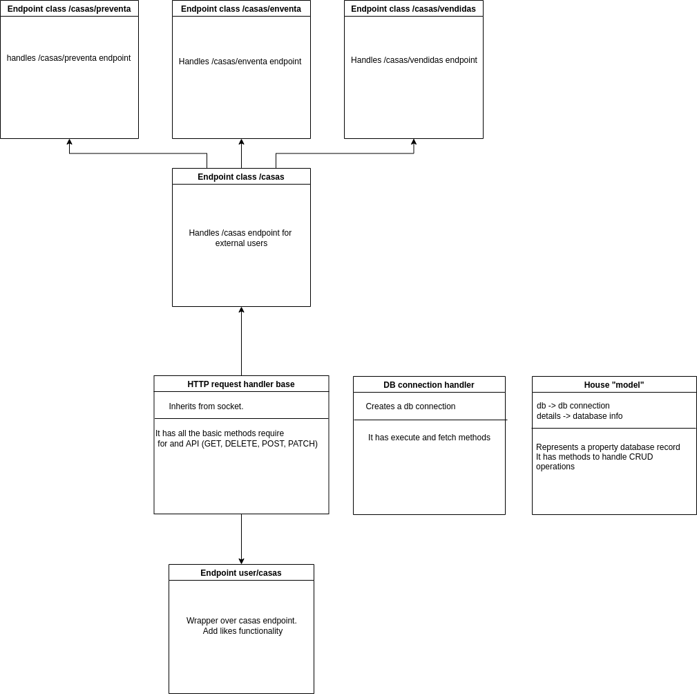
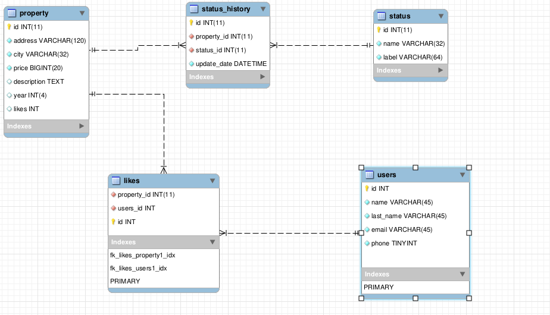

# Prueba desarrollador backend Habi

## Planteamiento de la solucion

- Para la creacion de la API no se utilizaran frameworks sino librerias internas de Python como http.
- Para la conexion a la base de datos no se utilizara ninguna ORM sino librerias externas de Python como mysql-connector-python.
- Se propene el siguiente esquema como solucion como punto inicial de la solucion:



- El desarrollodo de la API se realizara guiada por pruebas (TDD)

Como todo proyecto, mientras se trabaja en el se van realizando cambios que se consideran pertinentes, aun asi, tener un modelo esquema te permite tener una idea clara de lo que quiere lograr como PMV

## Servicio "Me gusta"

Para implementar el microservicio de me gustas, se propone expandir los modelos de las bases de datos como sugiere el siguiente esquema:



El modelo propone una tabla intermedia, ya que la relacion se puede ver sencillamente como: Un usario puede darle me gusta a muchas propiedades, una propiedad puede tener me gustas de muchos usuarios.

Tambien se agrega el campo likes en la tabla property, pues asi puedo incrementar el valor de este cada ves que se realice una peticion POST. ej:

```Python
# Supongamos que este metodo maneja las peticiones post para insertar un like
def post(property_id, user_id):
  """Handles post for /likes
  e.g.: /likes?property_id=1&user_id=1
  """
  # Insert new like
  cursor.execute(
    f"""
      INSERT INTO likes
      (property_id, user_id)
      VALUES
      ({property_id}, {user_id})
    """
  )

  # Increments likes for the given property_id
  cursor.execute(
    f"""
      UPDATE property
      SET likes = likes + 1
      WHERE property_id = {property_id}
    """
  )

  cursor.commit()
```

De esta manera podemos traer los likes de una propiedad con la demas informacion

### Codigo SQL para extender los modelos de la base de datos
```SQL
-- -----------------------------------------------------
-- Table `habi_db`.`property`
-- -----------------------------------------------------

ALTER TABLE `habi_db`.`property`
ADD likes INT;

-- -----------------------------------------------------
-- Table `habi_db`.`users`
-- -----------------------------------------------------
CREATE TABLE IF NOT EXISTS `habi_db`.`users` (
  `id` INT NOT NULL,
  `name` VARCHAR(45) NOT NULL,
  `last_name` VARCHAR(45) NOT NULL,
  `email` VARCHAR(45) NOT NULL,
  `phone` TINYINT NOT NULL,
  PRIMARY KEY (`id`));


-- -----------------------------------------------------
-- Table `habi_db`.`likes`
-- -----------------------------------------------------
CREATE TABLE IF NOT EXISTS `habi_db`.`likes` (
  `property_id` INT(11) NOT NULL,
  `users_id` INT NOT NULL,
  `id` INT NOT NULL,
  INDEX `fk_likes_property1_idx` (`property_id` ASC) VISIBLE,
  INDEX `fk_likes_users1_idx` (`users_id` ASC) VISIBLE,
  PRIMARY KEY (`id`),
  CONSTRAINT `fk_likes_property1`
    FOREIGN KEY (`property_id`)
    REFERENCES `habi_db`.`property` (`id`)
    ON DELETE NO ACTION
    ON UPDATE NO ACTION,
  CONSTRAINT `fk_likes_users1`
    FOREIGN KEY (`users_id`)
    REFERENCES `habi_db`.`users` (`id`)
    ON DELETE NO ACTION
    ON UPDATE NO ACTION);
```